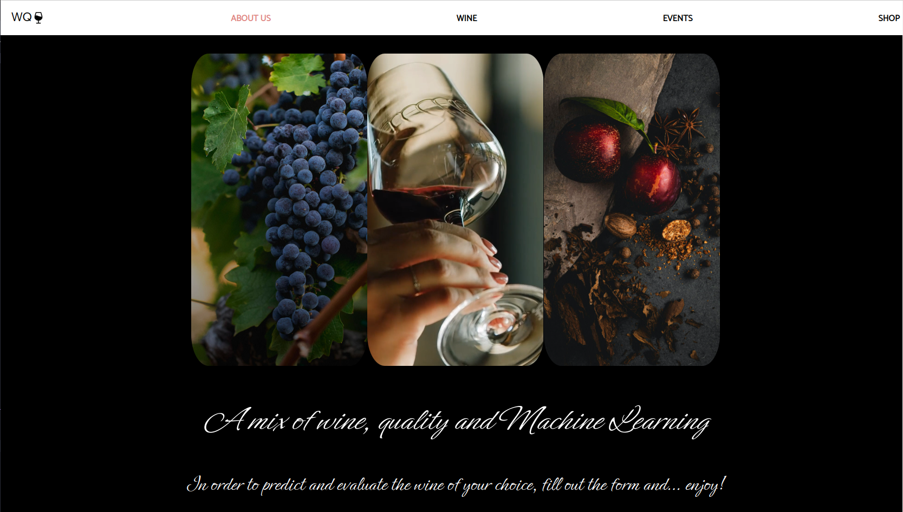
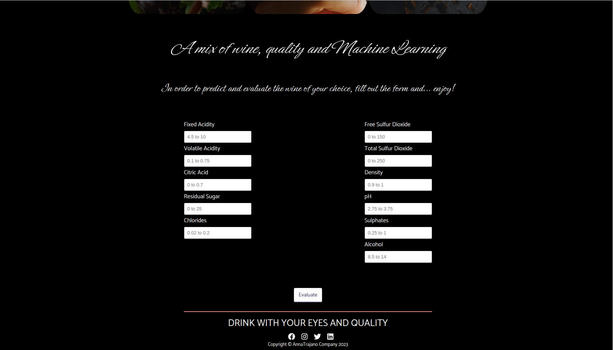
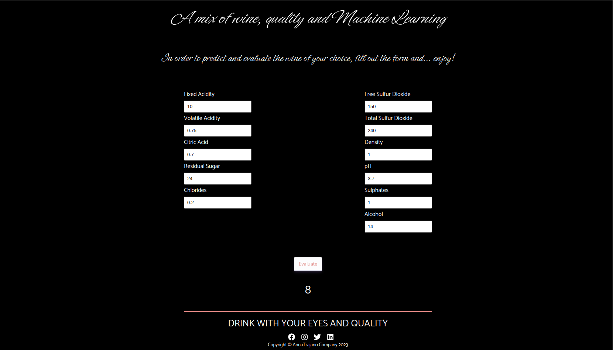

Este projeto contém os requisitos realizados por _[Anna Beatriz Garcia Trajano de Sá](www.linkedin.com/in/anna-beatriz-trajano-de-sá)_ enquanto cursava o curso de Pós-Graduação da PUC-RIO em Engenharia de Software. Ele engloba as disciplinas estudadas na segunda sprint (Qualidade de Software, Segurança e Sistemas Inteligentes) e corresponde à parte Front-end e Back-end da aplicação.

# Wine Quality App

Neste projeto desenvolvi um app para avaliar vinhos com base em alguns atributos.

Para isso, foi preciso construir e treinar um modelo Machine Learning a partir de um dataset.

O front-end da aplicação foi feito em React e o back-end em Flask!

Veja o exemplo a seguir do layout do projeto!

## Layout

Page 1 - Header and Background            
:-------------------------:|
  |

Page 1 - Form              
:-------------------------:|
  |

Page 1 - Form and Footer            
:-------------------------:|
  |

 
## Instalação do projeto localmente:
 
Após cada um dos passos, haverá um exemplo do comando a ser digitado para fazer o que está sendo pedido, caso tenha dificuldades e o exemplo não seja suficiente, não hesite em me contatar em _annagarcia@id.uff.br_ 

1. Abra o terminal e crie um diretório no local de sua preferência com o comando **mkdir**:
```javascript
  mkdir projetos
```

2. Entre no diretório que acabou de criar e depois clone o projeto:
```javascript
  cd projetos
  git clone git@github.com:annatrajano/wine-quality-mm.git
```

3. Acesse o diretório do projeto e, posteriormente, a pasta **api**. Depois utilize o comando **pip install -r requirements.txt** para instalar todas as libs necessárias ( já com a virtualenv ativada ):
```javascript
  cd wine-quality-mm/api
  (env)$ pip install -r requirements.txt
```

4. Para executar a API  basta digitar:
```javascript
  (env)$ flask run --host 0.0.0.0 --port 5000 --reload
```

5. Para inicializar a aplicação no front-end acesse a pasta **front** e depois utilize o comando **npm i** para instalar todas as dependências necessárias:
```javascript
  cd wine-quality-mm/front
  npm i
```

6. Por último, rode o comando **npm start** e acesse o projeto via browser, no caminho `http://localhost:3000/`.
```javascript
  npm start
```

7. Caso queira rodar o teste do modelo feito em Pytest, basta acessar a pasta da **api** e rodar o seguinte comando:
```javascript
  pytest -v test_model.py
```

## Habilidades Desenvolvidas

Neste projeto, desenvolvi as seguintes habilidades:

 - Componentes reativos e modulares;
 - Arquivos estáticos;
 - React Router;
 - CSS Module;
 - Estruturar uma API em Flask;
 - Treinamento e Costrução de um modelo Machine Learning;
 - Criação do teste para o modelo criado com Pytest.
 
 ## Referências - Front-end, Back-end e Machine Learning
 [React](https://legacy.reactjs.org/docs/getting-started.html)<br>
 [CSS Module](https://blog.logrocket.com/a-deep-dive-into-css-modules/)<br>
 [React Icons](https://react-icons.github.io/react-icons/)<br>
 [Flask](https://flask.palletsprojects.com/en/2.3.x/quickstart/)<br>
 [Pytest](https://docs.pytest.org/en/7.1.x/getting-started.html)<br>
 [Wine Quality - Dataset](https://archive.ics.uci.edu/dataset/186/wine+quality)<br>
 [Wine Quality Prediction](https://www.geeksforgeeks.org/wine-quality-prediction-machine-learning/)<br>
 [Building a Random Forest Classifier](https://soumenatta.medium.com/building-a-random-forest-classifier-with-wine-quality-dataset-in-python-95e798702f2c)<br>
 [Conventional Commits](https://gist.github.com/qoomon/5dfcdf8eec66a051ecd85625518cfd13)<br>


## Escopo do Projeto

 - Treinamento e Construção do Modelo Machine Learning com base no Dataset;
 - Construção da API em Flask;
 - Carregamento do modelo de forma embarcada na aplicação;
 - Teste do modelo em Pytest;
 - Construção do Front-end em React.
